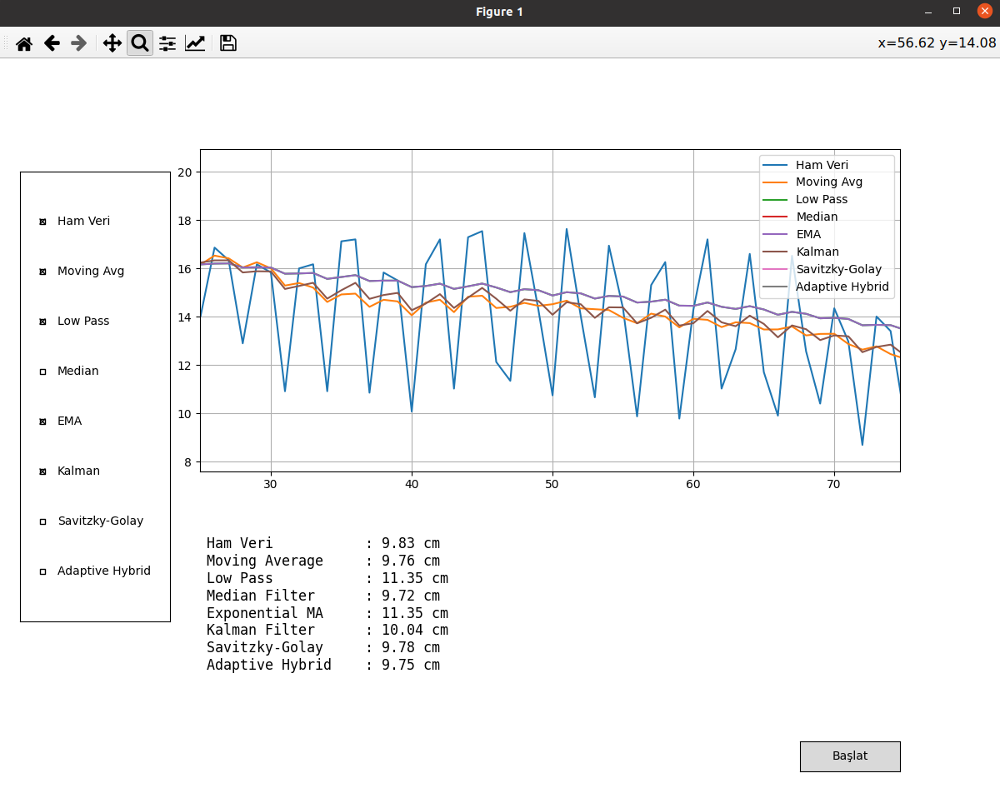

📊 Real-Time Sensor Filtering & Visualization in Python
This project provides a real-time data visualization and filtering platform using Python. It reads sensor data (e.g., from HC-SR04) via serial communication, applies various signal filtering techniques, and displays all results live in a dynamic graph.

🚀 Features
Serial communication with microcontrollers 

Real-time graph plotting using matplotlib

Multiple filters implemented:

Moving Average

Low Pass Filter

Median Filter

Exponential Moving Average (EMA)

Kalman Filter

Savitzky-Golay Filter

Adaptive Hybrid Filter (custom)

Toggle filters on/off during runtime

Start/Stop animation with a button

Text panel showing all filtered values in real-time

🧠 Purpose
The goal of this project is to test sensor accuracy, compare filtering methods, and analyze signal noise. This is especially useful in robotics, IoT, and embedded systems where noisy sensor data is common.

🛠 Requirements
Python 3.x

matplotlib

numpy

scipy
Install dependencies with:

bash
Copy
Edit
pip install matplotlib numpy scipy
📦 Files
main.py: Main script for reading, filtering, and plotting the sensor data.

filters.py: Contains all filter class implementations.

🔌 Hardware Example
You can use any sensor that outputs numeric values via serial. In this example, I used the HC-SR04 ultrasonic distance sensor with an Arduino that prints the distance in centimeters.

🖼 Preview

(Add a screenshot or screen recording GIF of the graph if possible)

📍 How to Run
Connect your Arduino or sensor board via USB.

Update PORT in main.py according to your system (e.g., COM3, /dev/ttyUSB0)

Run the script:

bash
Copy
Edit
python main.py
📬 Contact
Feel free to reach out if you want to contribute or need help adapting this platform to your own sensor.

📌 Keywords
Python, Sensor Filtering, Real-time Plot, Kalman Filter, Moving Average, Data Smoothing, Embedded Systems, IoT, Arduino, Serial Communication, Signal Processing
